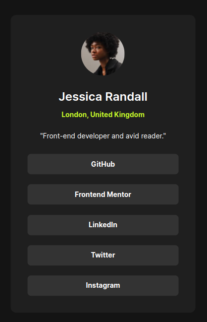

# Frontend Mentor - Social links profile solution

This is a solution to the [Social links profile challenge on Frontend Mentor](https://www.frontendmentor.io/challenges/social-links-profile-UG32l9m6dQ). Frontend Mentor challenges help you improve your coding skills by building realistic projects.

## Table of contents

- [Overview](#overview)
  - [The challenge](#the-challenge)
  - [Screenshot](#screenshot)
  - [Links](#links)
- [My process](#my-process)
  - [Built with](#built-with)
  - [Useful resources](#useful-resources)
- [Author](#author)

## Overview

### The challenge

Users should be able to:

- See hover and focus states for all interactive elements on the page

### Screenshot

### Links

- Solution URL: [GitHub](https://github.com/joaomarcosSR/social-links-profile)
- Live Site URL: [Social links profile](https://joaomarcossr.github.io/social-links-profile/))

## My process

### Built with

- Semantic HTML5 markup
- CSS custom properties
- Absolute Position

### Useful resources

- [Naming typography css variables](https://foxland.fi/naming-typography-css-variables/) - There are some suggestions to variable name.
- [Make your css variables manes suck less](https://www.fixate.it/blog/make-your-css-variable-names-suck-less) - There are some suggestions to variable name.

**Note: Delete this note and replace the list above with resources that helped you during the challenge. These could come in handy for anyone viewing your solution or for yourself when you look back on this project in the future.**

## Author

- Website - [Joao Ribeiro](https://joaomarcossr.github.io)
- Frontend Mentor - [@joaomarcosSR](https://www.frontendmentor.io/profile/joaomarcosSR)
